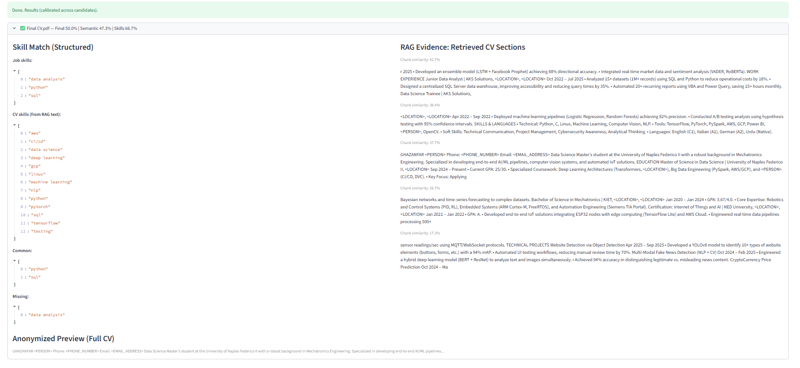
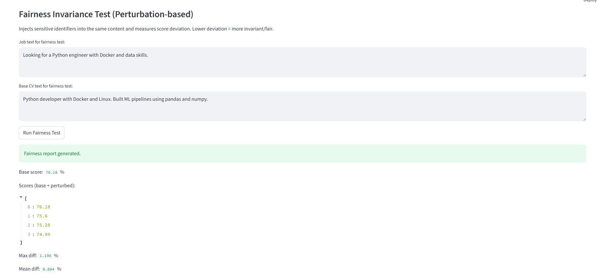

🛡️ FairScreen Project — Privacy-First AI for Bias-Free Hiring

Author: Ghazanfar Anees Siddiqui

Artificial Intelligence Systems Engineering

1. Project Overview

FairScreen is a privacy-preserving AI system designed to support candidate screening while strictly protecting personal data. The system evaluates candidates only on professional relevance such as skills and experience, while automatically removing personal identifiers including names, email addresses, phone numbers, and geographic locations.

The main objective of this project is to demonstrate how system architecture can enforce privacy, fairness, and regulatory compliance directly at the engineering level rather than relying solely on organizational policies or manual controls.

The system aligns with the following regulatory and ethical frameworks:

GDPR (EU Regulation 2016/679)

EU AI Act (High-Risk AI systems in the employment domain)

Privacy-by-Design principles

2. System Architecture

The application is implemented as a modular processing pipeline:

PDF CVs
→ Text Extraction
→ PII Anonymization (GDPR Air-Gap)
→ Relevant Section Retrieval (RAG)
→ Hybrid AI Scoring
→ Score Calibration
→ Explainability and Fairness Evaluation
→ Ranked Results (Human Review)

Each component operates independently, enabling clear separation of responsibilities, easier testing, and safer deployment. Personal data is removed before any AI processing occurs, ensuring that sensitive information never reaches the inference layer.

3. GDPR Air-Gap (Privacy Enforcement)

Before any AI processing:

Personal data is detected using Microsoft Presidio.

The system identifies sensitive entities including:

Person names

Email addresses

Phone numbers

Geographic locations

Detected entities are replaced with anonymized tags such as:

<PERSON>, <EMAIL_ADDRESS>, <PHONE_NUMBER>, <LOCATION>

Only sanitized text is forwarded to downstream modules. This creates a strict privacy boundary between raw data and AI processing. Even if the model or container is compromised, personal data is not present inside the inference layer.

4. Retrieval-Augmented Processing (RAG)

Instead of scoring the entire CV text, the system divides each document into smaller logical segments. A similarity search retrieves only the top-k most relevant segments based on the job description.

This improves:

Matching relevance

Signal-to-noise ratio

Computational efficiency

Only the retrieved segments are used for scoring.

5. Hybrid Scoring Model

Candidate relevance is computed using a hybrid strategy:

Semantic similarity using sentence embeddings (Sentence Transformers).

Skill overlap scoring extracted from the text.

Weighted aggregation of both signals.

This combination produces more stable and meaningful rankings than relying on a single metric.

6. Score Calibration

Raw similarity scores are normalized using Min-Max calibration. This ensures that scores remain comparable across different candidate pools and prevents artificial score compression or inflation.

Final scores are presented as percentages for clarity and interpretability.

7. Explainability

For each ranked candidate, the system extracts the most influential text segments that contributed to the score. These segments provide transparent justification for the ranking and allow manual verification of system behavior.

This supports accountability and interpretability requirements.

8. Fairness Evaluation

A fairness consistency test is integrated into the system. Artificial identity variations are applied to anonymized text, and the stability of the ranking is measured. If the ranking remains consistent, the system demonstrates invariance to identity-related information.

This provides empirical evidence that the model does not respond to personal attributes.

9. Bias Mitigation Strategy

Bias is mitigated structurally through architectural design:

Names removed → reduces gender and ethnicity bias

Locations removed → reduces nationality bias

Contact details removed → protects privacy

Human review enforced → prevents automated decision making

The system evaluates only technical and professional content.

10. Local Installation (Development Mode)

Activate the virtual environment:

cd FairScreen_Project
source venv/bin/activate

Install dependencies:

pip install -r requirements.txt
python -m spacy download en_core_web_lg

Run locally:

streamlit run src/app.py

Open in browser:

http://localhost:8501

11. Docker Deployment (Production Simulation)

Build the image:

docker build -t fairscreen .

Run the container:

docker run -p 8501:8501 fairscreen

Open in browser:

http://localhost:8501

12. System Limitations

The system does not make hiring decisions.

It provides decision support only.

Human oversight is always required.

Fairness evaluation is statistical and cannot guarantee absolute neutrality.

13. Educational Value

This project demonstrates:

Applied AI system design

Privacy engineering

Regulatory compliance implementation

Modular software architecture

Explainable AI techniques

Fairness validation methods

Containerized deployment

14. Conclusion

FairScreen demonstrates how responsible AI systems can be engineered using strong architectural controls. Privacy, fairness, transparency, and performance are addressed directly within the system design rather than relying solely on policy or documentation.

15. Results

